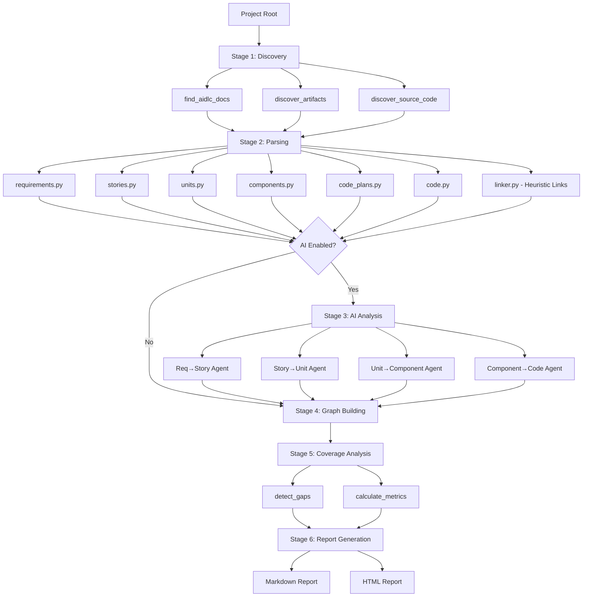
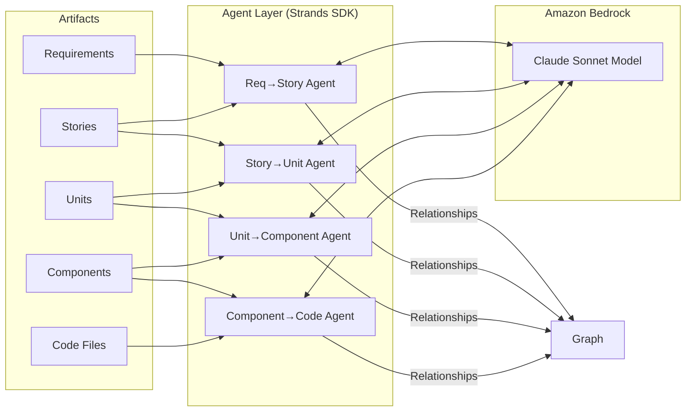
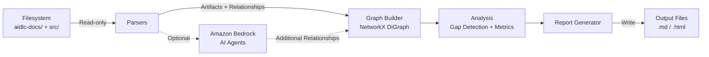
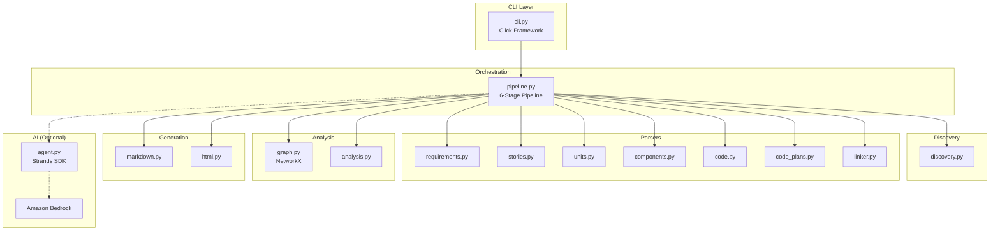

<!--
SPDX-License-Identifier: MIT
Copyright (c) 2026 AIDLC Traceability Tool Contributors
-->

# Architecture Documentation

## System Overview

The AIDLC Traceability Matrix Tool is a Python CLI application that generates traceability matrices from AI-DLC project artifacts. It uses a 6-stage pipeline architecture with optional AI-powered analysis via Amazon Bedrock.

## Pipeline Architecture

## Multi-Agent AI Architecture

When AI analysis is enabled, four specialized agents run via Amazon Bedrock (Claude Sonnet):

Each agent is specialized for its artifact pair, preventing context pollution and enabling focused analysis.

## Data Flow

**Key properties:**

- The tool only **reads** project files; it does not modify them
- Reports are written to the local filesystem only
- Amazon Bedrock calls are outbound HTTPS (TLS 1.2+) and only occur when AI is enabled
- No data is persisted between runs

## Component Diagram

## Technology Stack

| Component | Technology                      | Purpose                                       |
| --------- | ------------------------------- | --------------------------------------------- |
| CLI       | Click                           | Command-line interface                        |
| Models    | Pydantic                        | Data validation and serialization             |
| Graph     | NetworkX                        | Directed graph for traceability relationships |
| AI        | Strands Agents + Amazon Bedrock | Optional relationship discovery               |
| AWS       | boto3                           | Amazon Bedrock API access                     |
| Templates | Jinja2 (available)              | Report template rendering                     |
| Output    | Rich                            | Terminal formatting                           |
